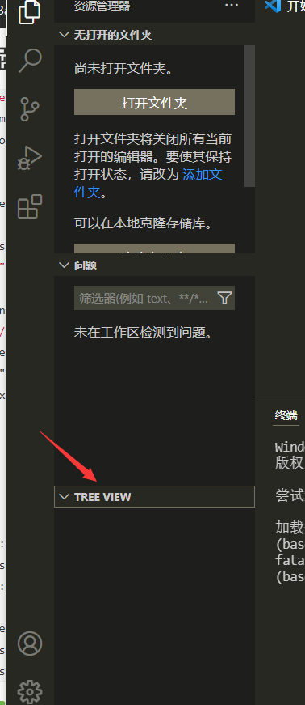
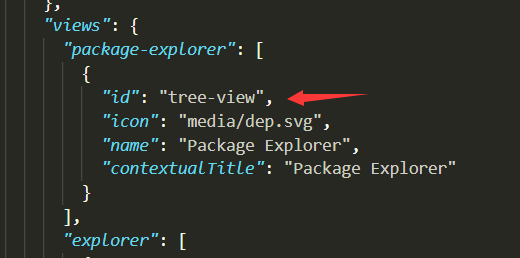
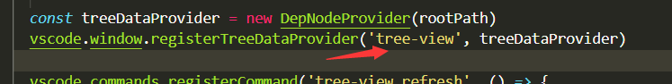
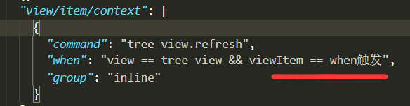
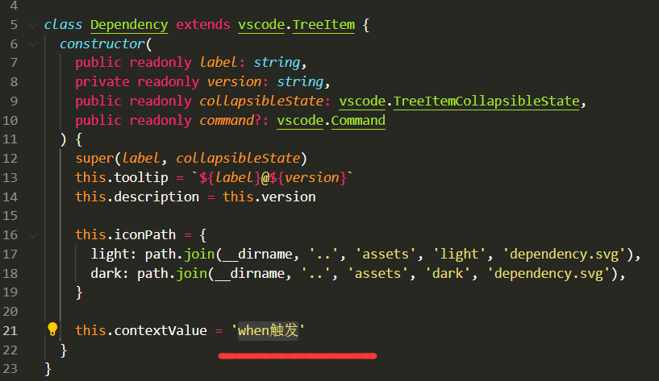
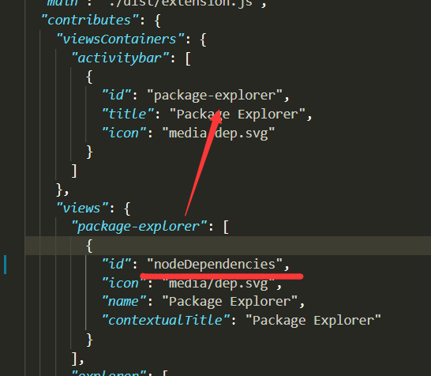

<!-- 这个示例利用树视图来展示当前文件夹中所有的Node.js依赖 -->

explorer 栏在这里


1. 注册 TreeDataProvider 可以通过两种方式实现：
   vscode.window.`registerTreeDataProvider`：注册树数据的 provider，需要提供视图 ID 和数据 provider 对象
   vscode.window.`createTreeView`：通过视图 ID 和数据 provider 来创建视树视图，这会提供访问 树视图 的能力，如果你需要使用 TreeView API，可以使用 createTreeView 的方式
2. TreeItemCollapsibleState.Collapsed（折叠）、TreeItemCollapsibleState.Expanded（展开）、TreeItemCollapsibleState.None（无子节点，不会触发 getChildren 方法）控制节点的折叠状态
3. 更新视图内容
   命令：
   需要利用 onDidChangeTreeData 事件
   注意 vscode 里的命名风格`带下划线的是 EventEmitter，不带下划线的是 Event`
   我们可以在 package.json 中定义一条更新命令并注册
   按钮：

   ```JSON
   "menus": {
       "view/title": [
           {
               "command": "nodeDependencies.refreshEntry",
               "when": "view == nodeDependencies ",
               "group": "navigation"
           },
       ]
   }

   ```

   group 属性用于菜单项的排序和分类，其中值为 navigation 的 group 是用来将置顶的

4. 添加到视图容器（View Container）并`将视图和视图容器绑定`
   可以看到左侧的视图容器和树视图
   注意 id 要一样
   
   
5. 视图行为解读
   view/title：位置在视图标题栏上，可以用"group": "navigation"来保证其优先级
   view/item/context：位置在树节点上，可以用"group": "inline"让其内联显示
   我们可以在 when 字段中使用 `TreeItem.contextValue 的数据`，来控制相应行为的显示
   
   
6. 视图欢迎内容

7. `为 container 容器 提供视图`(container 容器可以是自己注册的，也可以是 vscode 自带的)
   
