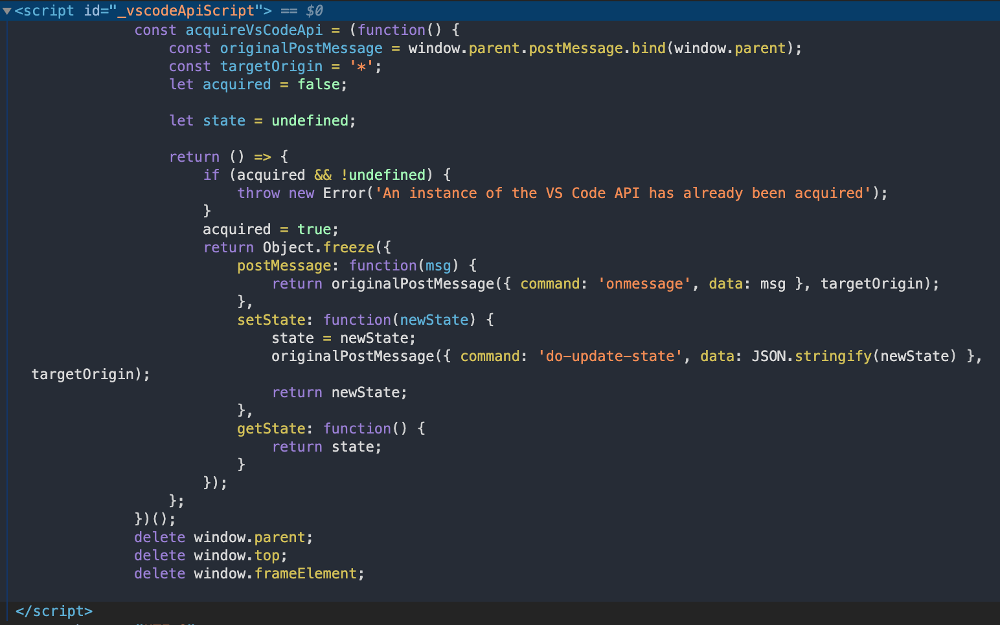

1. api 文件跟設定不需要繁瑣的一條條列出學完，重點是知道大方向跟觀念，並了解怎麼照著自己想做的應用的方向查詢文件，並動手實際驗證。
2. Configuration

```JSON
{
...
"contributes": {
        ...
        "configuration": {
          "title": "${Extension專案設定的主標題}",
          "properties": {
            "${套件的Namespace}.${設定選項名稱}": {
              "type": "${使用者輸入資料類型: boolean、string、number...}",
              "default": "${選項預設值}",
              "description": "${選項內容描述}",
              ...
            },
          }
        }
        ...
	},
...
}

```

可以在 value 裡直接使用 markdown 語法，vscode 會自動將 markdown 渲染出來

3. 跟 extension 開發脫不了關係的 window 命名空間 api

- Variable:
- Event
- Function

4. DataProvider 設計解析
5. vscode.EventEmitter 的用法

```JS
/**
 * 創建新的EventEmitter物件
 */
const eventEmitter = new vscode.EventEmitter();

/**
 * 發射事件相關資料
 */
eventEmitter.fire('new changed data!');

/**
 * 監聽與事件相關資料
 */
eventEmitter.event(message => {
	console.log(`Receive message: ${message}`); // 'Receive message: new changed data!'
});
```

> 註：跟 Nodejs 內建的 EventEmitter 或其他程式框架常見的 EventBus 比起來，vscode.EventEmitter 的用法簡單與簡化許多。通常在其他 library 的實作裡，一個 eventEmitter 可以監聽多個事件，同時在傳送事件源頭的資料時指定其中一個事件發射資料，但在 vscode.EventEmitter 裡，emitter 並不會監聽多個事件，而僅會將不同事件源頭的資料發佈給訂閱者，這是專為 VSCode 的元件特化的設計。

6. OutputChannel，輸出 Extension 的訊息(`可以显示进度等...`)

```JS
const channel = vscode.window.createOutputChannel('ChannelPractice')

channel.append('[ newLineText ]')
channel.appendLine('[ appendLine after previous line] ')
channel.append('[ newLineText ]')
channel.appendLine('[ appendLine after previous line] ')

channel.show()
```

7. 讓 WebView 與 Extension 通信
   在 `iframe 中`我們會使用兩個方法來坐傳接訊息

```JS
// 傳送訊息給外部Js，也可傳送字串等基本型別至外部
const yourMessageData = {
   ...
};
window.parent.postMessage(yourMessageData);

// 接收外部傳來的訊息
window.addEventListener('message', (e) => {
    const receiveData = e.data;
    ...
});
```

實際上，`VSCode Extension 運作的行為與 iframe 相同`，因此在 WebView 裡面，我們一樣可以通過以下方式傳接：

```JS
const vscode = acquireVsCodeApi();

// 傳送訊息給Extension的Js
vscode.postMessage({
 ...
});

// 接收Extension傳來的訊息
window.addEventListener('message', (e) => {
    const receiveData = e.data;
    ...
});
```

extension 中如何與 Webview 傳接訊息：

```JS
webviewPanel = vscode.window.createWebviewPanel(
				'webviewId',
				'WebView Title',
				vscode.ViewColumn.One,
				{
					enableScripts: true
				}
			);

...

// 傳送訊息給Webview
webviewPanel.webview.postMessage({...});

// 接收Webview傳來的訊息
webviewPanel.webview.onDidReceiveMessage((e) => {
    ...
});
```

8. 需要使用 css 變數的元素，我們可以參考 VSCode 文件的 Theme Color 一節
9. 我們打開 Webview 時，除了`_defaultStyles`，還有看到 Webview 內的 head 標籤內有一個 id 為`_vscodeApiScript`的 script 標籤
   
   acquireVsCodeApi 這個函數會回傳使用`Object.freeze`過的物件，使該物件無法增加或刪除裡面的屬性。
   用於從 WebView 傳送資料至 extension 的 postMessage，我們可以看到是保存了原 webview.parent 下面的 postMessage 方法

```JS
const originalPostMessage = window.parent.postMessage.bind(window.parent);
```

10. webview:懒汉单例模式
    https://ithelp.ithome.com.tw/articles/10248236
11. 选择本地文件

```JS
  vscode.window.showOpenDialog({
    title: 'Select a folder as code-manager workspace',
    canSelectFiles: false,
    canSelectFolders: true,
    canSelectMany: false,
  })
```

12. action 定义

```TS
interface Action<T extends ObjectLike> {
 type: string;
 payload: T
}
```

https://ithelp.ithome.com.tw/articles/10252627

13. extension 的 api
    Extensions API 描述
    `all` 唯讀屬性，VSCode 安裝的 extension 的物件陣列
    `getExtension` 給定指定的 extensionId，取得對應的 extension 物件
    `onDidChange` 監聽 extension 被安裝、卸載、停用、啟用的方法

    ```JS
    vscode.extenison.all
    ```

14. language 命名空間下的 api
15. web 裡怎麼提供 editor 區塊編輯
    javascript 的工具 `prismjs`
    PrismJS 是一个前端代码高亮库
16. 在 Webview 中使用 Router 時可能遇到的問題
    BrowserRouter 是使用瀏覽器 Html5 的 History，他在改變 url 時，會與 vscode 的 url 格式起衝突
    `解法一: 使用 MemoryRouter`
    `解法二: 使用HashRouter`
