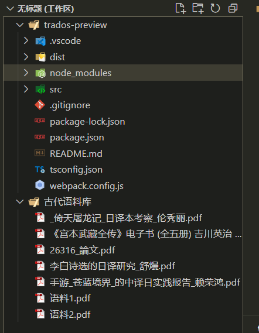
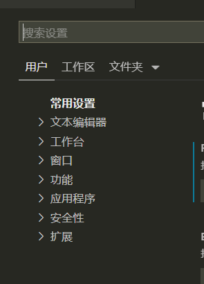

1. 删除本地分支
   > git branch -d name
2. 删除远程分支(需要保证远程分支不是默认分支)

   > git push origin --delete master

3. vscode 的 multi-workspace 使用

   > add folder to workspace

   
   好处是不用一次打开多个编辑器了

4. enableProposedApi 属性
5. sidebar 有几种
   - 资源管理器 explorer (最常用的 view)
   - git 源代码管理 scm
   - debug 界面 debug
   - test 界面 test
   - 远程界面 remote (需要开启 enableProposedApi )
6. activity bar 是最左边的那条活動條 显示 icon 的；點擊可以展開跟關閉 SideBar
7. 最下面的 status bar 主要用於呈現 extenison 的 output、debug 的資訊
8. vscode 的设定的两种作用域
   User Settings: 使用者設定，這裡設定檔為全域(global scope)，會影響所有 vscode 開啟的 window 的編輯器。
   Workspace Settings: 工作區設定，在工作區(workspace)底下的.vscode 或.code-workspace 資料夾底下的設定。當工作區配置和使用者設定到同一個設定選項時，VSCode 會以工作區對該專案的特定配置為主。
   默認情況下，VSCode 會抓取.vscode 資料夾下面的設定檔案，當使用 multi-root workspace 的功能時，`vscode 則是會抓取.code-workspace`
   
   Input、Dropdown、CheckBox 三種元件來設定
9. 一切皆 command
10. Workspace Configuration 與 Data Storage 比較
    https://ithelp.ithome.com.tw/articles/10244737
